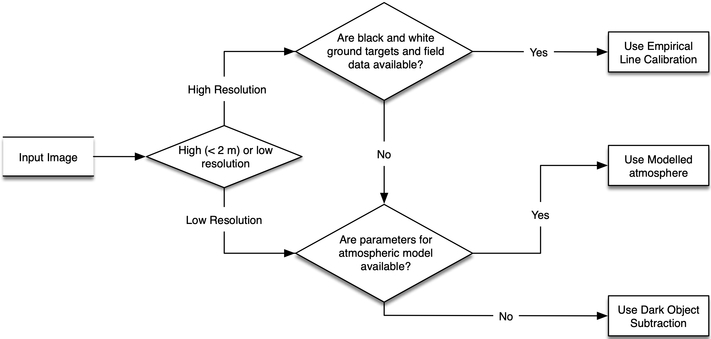
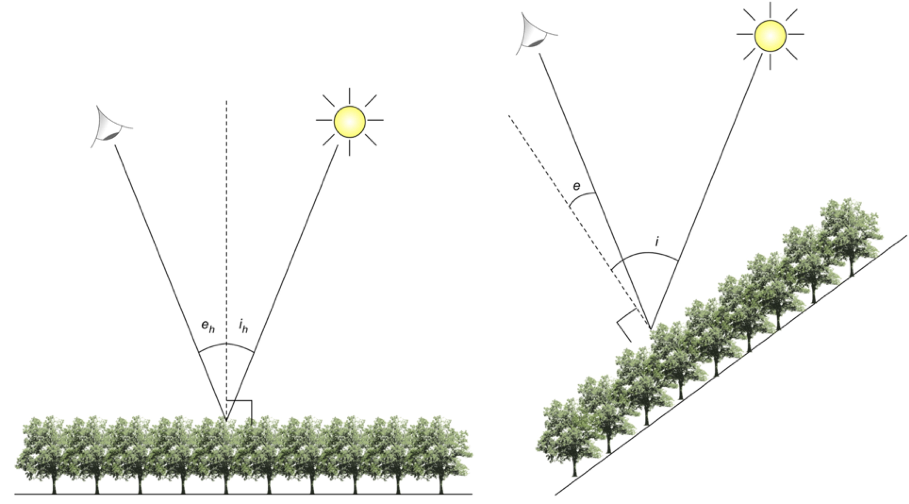
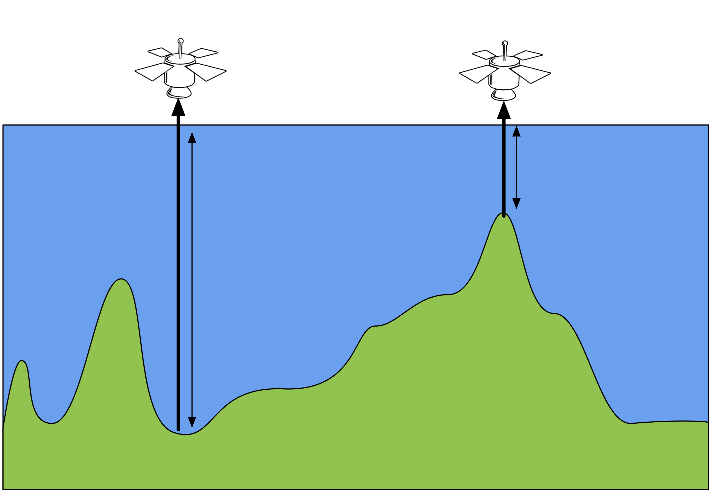
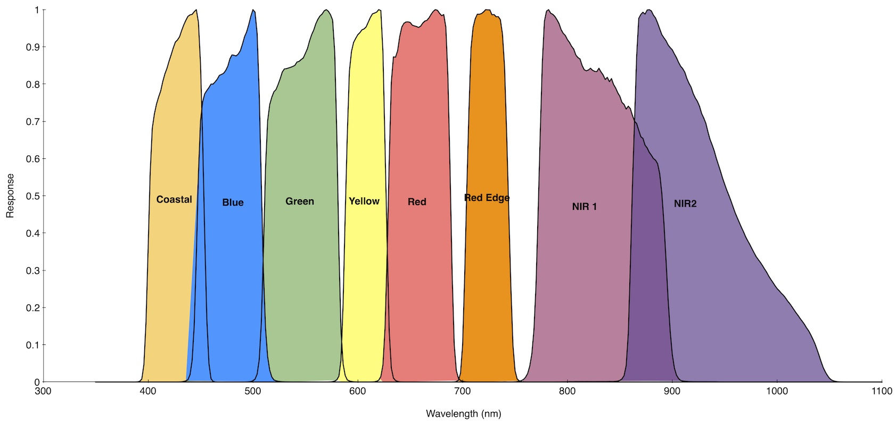

Background
============

Definitions
--------------

Radiance
~~~~~~~~~~

Optical data recorded in a particular wavelength region :math:`\lambda` and obtained from the data provider, should be given in units of radiance :math:`(\textrm{L}_{\lambda} \textrm{W m}^{-2} \textrm{sr}^{-1} \mu^{-1})`. In order to compress (i.e., reduce the file size), the image is typically provided with a gain and offset to convert the pixel value, commonly referred to as the digital number (DN), to radiance where:

.. math::
    \textrm{L}_{\lambda} = (\textrm{gain} \times \textrm{DN}) + \textrm{offset}

One of the first steps in processing that ARCSI will undertaken is to transform the input image into 'at sensor radiance'.

At Sensor Reflectance
~~~~~~~~~~~~~~~~~~~~~~~

At sensor reflectance, also referred to as top of atmosphere (TOA) reflectance, is a standard and easily calculated ratio of the incoming radiant energy (light) from the sun (ESUN) and the corresponding radiance measured by the sensor. The radiance measured at the sensor differs from the incoming signal due to the reflectance of the Earth surface and the atmosphere (or part of the atmosphere) the signal has transmitted through. Although providing a standard measure and common range of values (0 - 1), the reflectance measurement includes the reflectance from the atmosphere and the ground surface and therefore images taken at different times are not directly comparable. At sensor reflectance is calculated as:

.. math::
    \rho = \frac{\pi \cdot L_{\lambda} \cdot d^{2}}{\textrm{ESUN}_{\lambda} \cdot \cos(\theta_{s})}

where :math:`\lambda` is the wavelength, :math:`\rho_{\lambda}` is the spectral (planetary or TOA) reflectance for wavelength :math:`\lambda, L_{\lambda}`
is the spectral radiance (:math:`\textrm{W m}^{-2} \textrm{sr}^{-1} \mu\textrm{m}^{-1}`) d is the Earth-Sun distance in astronomical units, :math:`\textrm{ESUN}_{λ}` is the
mean solar exoatmospheric irradiance in units of :math:`\textrm{W m}^{-2} \mu\textrm{m}^{-1}`, and :math:`\cos(\theta_{s})` is the solar zenith angle.

Surface Reflectance
~~~~~~~~~~~~~~~~~~~~~~

Surface reflectance, also called 'bottom of atmosphere reflectance' is the ratio of incoming radiance (i.e., from the sun) with the radiance that is measured by the sensor without *any* atmospheric effect and should be equivalent to the signal measured if the sensor was at ground level or there was no atmosphere. To derive this measurement, the effect of the atmosphere needs to be removed from the at sensor radiance
measured at the sensor. There are a number of options for this:

-   Empirical Line Calibration

-   Dark Object Subtraction

-   Modelling Atmospheres

The Empirical Line Calibration (Baugh and Groeneveld, 2007) is commonly used to correct high-resolution airborne imagery but requires that ground data of bright and dark targets be captured at the time of the overflight. Dark Object Subtraction methods (Chavez  Jr 1988) are relatively simple and require relatively little inputs so can be easily applied to all image data but do not produce the most reliable and consistent results. It is, therefore, the method used when the others are not available. Modelled Atmospheric Correction Methods (Vermote 1997) model reflection, absorption and scattering by the atmosphere and commonly used models include 6S (Vermote 1997), LOWTRAN, MODTRAN, FLAASH, ATCOR and HYCOR. These models require many parameters to be known or estimated and can, therefore, be complex to apply. However, for lower resolution imagery or where ground spectra for targets are not available, it is the best solution.

The following flowchart provides a recommended decision process you can go through to decide the method of atmospherical correction you should follow with you imagery.

ARCSI provides tools for undertaking a dark objective subtraction and creating and applying a modelled atmosphere to earth observation data.

Standardised Reflectance
~~~~~~~~~~~~~~~~~~~~~~~~~

The method of Shepherd and Dymond (2003) was implemented to provide a standardised reflectance product. Standardised reflectance refers to a product which is normalised for the solar and sensor view angles and in this case topography. In terms of providing a topographic correction, this method
only works for images where the solar elevation is between 50 and 70 degrees (i.e., from late spring to early autumn) but does not produce artefacts outside of this range. Standardised reflectance is defined using the following equation

.. math::
    \rho^{dir}_{h} = \frac{\pi L}{\frac{E^{dif}}{\gamma}+\beta E^{dif}}

where :math:`\rho^{dir}_{h}` is the direct reflectance for a horizontal surface, L is the radiance at the bottom of the atmosphere, :math:`E^{dir}` is the direct component of the irradiance and :math:`E^{dif}` is the diffuse component, the ratio :math:`\beta` is evaluated using a bidirectional reflectance distribution model but in the study a constant of 1 was used
Shepherd and Dymond (2003):

.. math::
    \gamma = \frac{cos(i)+cos(e)}{cos(i_h)+cos(e_h)}

where :math:`i` and :math:`e` are the incidence, and exitance angles on an inclined surface, and :math:`i_h` and :math:`e_h` are the incidence and exitance angles on a horizontal surface:

6S Parameters
--------------

To calculate surface reflectance the 6S radiative transfer model will be used. The 6S model has a number of inputs which need to be specified, specifically

 * Atmospheric Profile
 * Aerosol Profile
 * Ground Reflectance
 * Geometry
 * Altitude
 * Wavelength
 * 6S Outputs

For detailed information on the parameterisation of 6S visit the Py6S website <http://py6s.readthedocs.org/en/latest/params.html>.

Atmospheric Profile
~~~~~~~~~~~~~~~~~~~~~

A number of standard profiles are available NoGaseousAbsorption, Tropical, MidlatitudeSummer, MidlatitudeWinter, SubarcticSummer, SubarcticWinter and USStandard1962. These can all be specified via the terminal within ARCSI. Additionally, user specified values of water and ozone within the vertical path within the atmosphere can also be specified. The amount of water within the vertical water column has the
largest effect of the SWIR channels.

Aerosol Profile
~~~~~~~~~~~~~~~~~~~

The aerosol profile and particularly the aerosol optical depth (AOD) / aerosol optical thickness (AOT) make a significant difference to the reflectance of the visible bands following atmospheric correction.

A number of standard profiles are available NoAerosols, Continental, Maritime, Urban, Desert, BiomassBurning and Stratospheric. These are all available within ARCSI, from the terminal (``arcsi.py``). Alternatively, a user defined set of values can be specified for the proportion of dust, water, oceanic and soot like aerosols. The total of the proportions needs to add up to 1, for example oceanic = 0.75 and dust = 0.25 or oceanic = 0.35, water = 0.35 and dust = 0.30.

Additionally, the AOT also needs to be specified. This can be specified as a single value to be used across the whole scene via the ARCSI command line utility. The amount of AOT has a significant effect of the visual reflectance of the Landsat scene during atmospheric correction.

Ground Reflectance
~~~~~~~~~~~~~~~~~~~~

The reflectance of a ground target needs to be specified for the model to be executed on. The ground surface can either be a Lambertian or bidirectional reflectance distribution function (BRDF) surface. 6S has a number of implemented BRDF models but they need to be parameterised. Within ARCSI the standard Lambertian surface targets Green Vegetation, Clear Water, Sand and Lake Water are available.

Geometry
~~~~~~~~~~~~

This is the geometry of the sensor and is specified by ARCSI from the header file(s) associated with the input image.

Altitude
~~~~~~~~~~

This is the altitude of the sensor and ground surface. Within ARCSI only the approximate altitude of the ground surface needs to be specified and the sensor altitude is already defined internally. The surface altitude can also be provided via the inclusion of a DEM image file as a command to ARCSI. Where a DEM is provided ARCSI will subset, resample and if needed reproject the DEM is match the pixels of the inputted image. Surface altitude is important is it defines the depth of the atmosphere and therefore the the effect the atmosphere has on the signal.

Wavelength
~~~~~~~~~~~~~

The wavelength is the response function of the sensor band being corrected (e.g., Figure below shows sensor response functions for WorldView-2). ARCSI specifies the response function(s) for each wavelength of the sensor.

6S Outputs
~~~~~~~~~~~~~

6S returns a set of coefficients, which are printed to the console during execution of ARCSI, for converting at sensor radiation to surface reflectance. The 6S coefficients :math:`aX`, :math:`bX` and :math:`cX` are applied to the input image using the following equations:

.. math::
    y = aX \times (\textrm{measured radiance})-bX
    \\
    \textrm{surface reflectance}=\frac{y}{1.0 + cX \times y}

Bibliography
--------------

Baugh, W., Groeneveld, D. (2007). Empirical proof of the empirical line International Journal of Remote Sensing  29(3), 665-672. https://dx.doi.org/10.1080/01431160701352162

Chavez Jr., P. (1988). An improved dark-object subtraction technique for atmospheric scattering correction of multispectral data Remote Sensing Of Environment  24(3), 459 479. https://dx.doi.org/10.1016/0034-4257(88)90019-3

Dymond, J., Shepherd, J. (2004). The spatial distribution of indigenous forest and its composition in the Wellington region, New Zealand, from ETM+ satellite imagery Remote Sensing Of Environment  90(1), 116 125. https://dx.doi.org/10.1016/j.rse.2003.11.013

Gillingham, S., Flood, N., Gill, T. (2012). On determining appropriate aerosol optical depth values for atmospheric correction of satellite imagery for biophysical parameter retrieval: requirements and limitations under Australian conditions International Journal Of Remote Sensing  34(6), 2089 2100. https://dx.doi.org/10.1080/01431161.2012.738945

Shepherd, J., Dymond, J. (2003). Correcting satellite imagery for the variance of reflectance and illumination with topography International Journal Of Remote Sensing  24(17), 3503 3514. https://dx.doi.org/10.1080/01431160210154029

Wilson, R. (2013). Py6S: A Python interface to the 6S radiative transfer model Computers and Geosciences  51, 166 171. https://dx.doi.org/10.1016/j.cageo.2012.08.002

Wilson, R., Milton, E., Nield, J. (2014). Spatial variability of the atmosphere over southern England, and its effect on scene-based atmospheric corrections International Journal Of Remote Sensing  35(13), 5198 5218. https://dx.doi.org/10.1080/01431161.2014.939781

Vermote, E., Tanre, D., Deuze, J., Herman, M., Morcrette, J. (1997). Second Simulation of the Satellite Signal in the Solar Spectrum, 6S: An overview IEEE Transactions of Geoscience and Remote Sensing  35(3), 675 686.

* :ref:`genindex`
* :ref:`modindex`
* :ref:`search`

