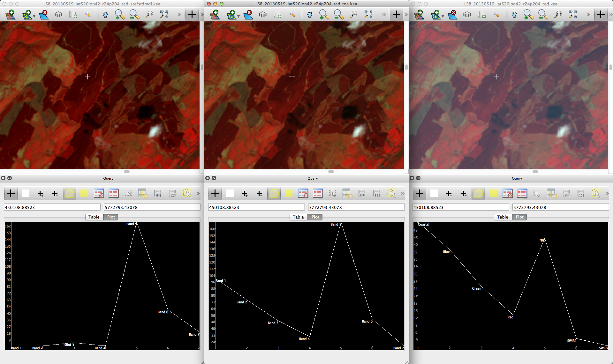

Tutorial
=========

Purpose
---------
Through this tutorial you will gain an understand of the process of
correcting Landsat imagery to surface reflectance using the Atmospheric
and Radiometric Correction of Satellite Imagery (ARCSI) software,
developed at Aberystwyth University [1]_. Specifically, you should
understand the parameters which are used for the atmospheric correction
of imagery and how changing the values of those parameters alters the
resulting image. ARCSI has a feature which allows the prediction of the
key AOT value from the image data itself and you will try this feature.
Finally, you will also learn how to use some of the features in ARCSI to
handle and rapidly process a large number of scenes.

Software
----------
The ARCSI software makes use a number of packages including:

#. 6S

#. Py6S

#. The Remote Sensing and GIS software Library (RSGISLib)

6S
~~~

6S is a radiative transfer model which can be used for the atmospheric
correction of remotely sensed data . Specifically, the software allows
for the simulation of satellite and airborne (plane) observations and
accounts for the elevation of the target, allows both lamberian and
anisotropic surfaces to be used and the calculation of gaseous
absorption. The software can be download from http://6s.ltdri.org.

Py6S
~~~~~

Py6S is a python binding to 6S, which allows the 6S codes to be called
directly as python objects with a simple python script . Py6S can be
downloaded from http://py6s.readthedocs.org.

RSGISLib
~~~~~~~~~

RSGISLib was developed at Aberystwyth University and was designed to
fill the gaps within existing software packages while providing a
platform to ease the implementation of new and innovative algorithms and
data processing techniques . Within the ARCSI software RSGISLib is used
to apply the calibration coefficients to the image data in an efficient
manor. RSGISLib is written in C++ but provides a python
binding to allow easy integration with other tools (such as Py6S).

ARCSI
~~~~~~

The ARCSI software is designed to make the application of 6S for the
correction of satellite imagery a simpler process, minimising the
inputs, which need to be specified by the user and extracting as much
information as possible from the RAW image header files provided by the
data provided (e.g., the USGS).

6S Parameters
--------------
To calculate surface reflectance the 6S radiative transfer model will be
used. The 6S model has a number of inputs which need to be specified,
specifically

* Atmospheric Profile
* Aerosol Profile
* Ground Reflectance
* Geometry
* Altitude
* Wavelength
* 6S Outputs

For detailed information on the parameterisation of 6S visit the Py6S
website http://py6s.readthedocs.org/en/latest/params.html.

Atmospheric Profile
~~~~~~~~~~~~~~~~~~~~

A number of standard profiles are available NoGaseousAbsorption,
Tropical, MidlatitudeSummer, MidlatitudeWinter, SubarcticSummer,
SubarcticWinter and USStandard1962. These can all be specified via the
terminal within ARCSI. Additionally, user specified values of water and
ozone within the vertical path within the atmosphere can also be
specified. The amount of water within the vertical water column has the
largest effect of the SWIR channels within the Landsat data.

Aerosol Profile
~~~~~~~~~~~~~~~~

The aerosol profile and particularly the aerosol optical depth (AOD) /
aerosol optical thickness (AOT) make a significant difference to the
reflectance of the visible bands following atmospheric correction.

A number of standard profiles are available NoAerosols, Continental,
Maritime, Urban, Desert, BiomassBurning and Stratospheric. These are all
available within ARCSI, from the terminal (`arcsi.py`). Alternatively,
a user defined set of values can be specified for the proportion of
dust, water, oceanic and soot like aerosols. The total of the
proportions needs to add up to 1, for example oceanic = 0.75 and dust =
0.25 or oceanic = 0.35, water = 0.35 and dust = 0.30.

Additionally, the AOT also needs to be specified. This can be specified
as a single value to be used across the whole scene via the ARCSI
command line utility. The amount of AOT has a significant effect of the
visual reflectance of the Landsat scene during atmospheric correction.

Ground Reflectance
~~~~~~~~~~~~~~~~~~~~

The reflectance of a ground target needs to be specified for the model
to be executed on. The ground surface can either be a Lambertian or
bidirectional reflectance distribution function (BRDF) surface. 6S has a
number of implemented BRDF models but they need to be parameterised.
Within ARCSI the standard Lambertian surface targets Green Vegetation,
Clear Water, Sand and Lake Water are available. Additionally, the Hapke
BRDF model is available with a standardised set parameters, although
this is currently experimental.

Geometry
~~~~~~~~~
This is the geometry of the sensor and is specified by ARCSI from the
header file(s) associated with the input image.

Altitude
~~~~~~~~~
This is the altitude of the sensor and ground surface. Within ARCSI only
the approximate altitude of the ground surface needs to be specified and
the sensor altitude is already defined internally.

Wavelength
~~~~~~~~~~~
The wavelength is the response function of the sensor band being
corrected. ARCSI specifies the response function(s) for each wavelength
of the sensor.

6S Outputs
~~~~~~~~~~~
6S returns a set of coefficients, which are printed to the console
during execution of ARCSI, for converting at sensor radiation to surface
reflectance. The 6S coefficients :math:`aX`, :math:`bX` and :math:`cX`
are applied to the input image using the following equations:

.. math::

   \begin{aligned}
   y = aX \times (\textrm{measured radiance})-bX \\
   \textrm{surface reflectance}=\frac{y}{1.0 + cX \times y}\end{aligned}

Run ARCSI
----------
Before running ARCSI you need to extract the Landsat scene from the
``tar.gz`` archive file (LC82040242013139LGN01.tar.gz). You could use
the command

::

    tar -zxf LC82040242013139LGN01.tar.gz

to extract the contents to the current directory but it would be good to
have a the contents of the ``tar.gz`` file extracted into a directory
for that scene. ARCSI provides a command to do that
``arcsiextractdata.py``. The command operates on all the ``tar`` and
``tar.gz`` files within the specified input directory (in this case RAW)
and the output directories (one for each input file) will all be created
in the ‘Inputs’ directory.

::

     arcsiextractdata.py -i ./RAW/ -o Inputs/

To use ARCSI to generate a surface reflectance product (alongside top of
atmosphere and radiance) the simplest method is to specify the
parameters via the command line as shown below:

::

    arcsi.py -s ls8 -f KEA --stats -p RAD TOA SREF --aeropro Maritime \
    --atmospro MidlatitudeSummer --aot 0.25 --surfacealtitude 0.4 -o ./Outputs \
    -i Inputs/LC82040242013139LGN01/LC82040242013139LGN01_MTL.txt 

\-s ls8
    specifies that it is a Landsat 8 scene which is being processed.

\-f KEA
    specifies that the output image file format should be KEA. Any GDAL
    support format can be used.

–stats
    specifies that the output images should be populate with statistics
    and pyramids – makes display much faster

-p RAD TOA SREF
    specifies the output products to be generated. You only need to
    specify what you want, e.g., SREF but if other products (e.g., RAD)
    are required then these will also be produced even if they are not
    specified.

–aeropro Maritime
    specifies that the ‘Maritime’ aerosol profile should be used.

–atmospro MidlatitudeSummer
    specifies that the ‘MidlatitudeSummer’ atmosphere profile should be
    used.

–aot 0.25
    specifies that an AOT value of 0.25 will be used for the correction.

–surfacealtitude 0.4
    specifies that the surface altitude (ground elevation) used for the
    correction is 400 m or 0.4 km. The value specified needs to be in
    KM.

-o ./Outputs
    specifies the output directory where all output file will be
    outputted to.

-i Inputs/LC82040242013139LGN01/LC82040242013139LGN01\_MTL.txt
    is the input images header file.

Once you have run the command (shown above) open the images within
TuiView and compare the surface reflectance, radiance and TOA images,
Figure [fig:comparisonOfSREFTOARAD]. Please remember that you can open
multiple TuiView windows and tile them (File > Tile Windows...). Using
the band combination NIR, SWIR1 and RED is recommended. As you view the
scene look at the shapefile of the spectral curve and the image pixel
values. Try to find similar features around clouds and away from clouds
(highly productive fields, for example; bright orange in the recommended
band combination), what do you notice about the image pixel values?

   Comparison of spectral curves for SREF, TOA and Radiance.

You should have noticed that they are different and that is due to the
fact that AOT is variable across the scene. Within this tutorial we
will just look at using a single value of AOT for correcting the scene
but ARCSI already has some functionality to create an AOT surface which
will be something for the future, particularly for scenes with high
cloud cover.

Changing AOT and Vertical Water Content
----------------------------------------
You have now atmospherically corrected a scene will a single set of
parameters but what parameters should you use. You will now undertake a
basic sensitivity analysis for AOT and vertical water content to see
what effect they have on your atmospherically corrected result.

Changing values of AOT
~~~~~~~~~~~~~~~~~~~~~~~
Valid values of AOT range from 0.0 to 1.0, it is suggested that you run
ARCSI using the following AOT values:

*  0.0
*  0.05
*  0.1
*  0.15
*  0.2
*  0.25
*  0.3
*  0.4
*  0.5
*  0.75
*  0.95

For example,

::

    arcsi.py -s ls8 -f KEA --stats -p RAD SREF --aeropro Maritime \
    --atmospro MidlatitudeSummer --aot 0.05 --surfacealtitude 0.4 \
    -o ./OutputsAOT005 \
    -i Inputs/LC82040242013139LGN01/LC82040242013139LGN01_MTL.txt 

::

    arcsi.py -s ls8 -f KEA --stats -p RAD SREF --aeropro Maritime \
    --atmospro MidlatitudeSummer --aot 0.1 --surfacealtitude 0.4 \
    -o ./OutputsAOT01 \
    -i Inputs/LC82040242013139LGN01/LC82040242013139LGN01_MTL.txt 

::

    arcsi.py -s ls8 -f KEA --stats -p RAD SREF --aeropro Maritime \
    --atmospro MidlatitudeSummer --aot 0.5 --surfacealtitude 0.4 \
    -o ./OutputsAOT05 \
    -i Inputs/LC82040242013139LGN01/LC82040242013139LGN01_MTL.txt 

::

    arcsi.py -s ls8 -f KEA --stats -p RAD SREF --aeropro Maritime \
    --atmospro MidlatitudeSummer --aot 0.95 --surfacealtitude 0.4 \
    -o ./OutputsAOT095 \
    -i Inputs/LC82040242013139LGN01/LC82040242013139LGN01_MTL.txt

Use TuiView to compare the results (e.g.,
Figure [fig:comparisonOfSREFAOTValues]). What changes do you observe?
Make notes on these changes with screenshots. Also, what do you notice
around areas of cloud cover?

.. figure:: Figures/TuiViewComparison_SREFAODValues.png
   :alt: Comparison of spectral curves for SREF images with AOT values
   of 0.05, 0.5 and 0.95.

   Comparison of spectral curves for SREF images with AOT values of
   0.05, 0.5 and 0.95.

Changing values of water content
~~~~~~~~~~~~~~~~~~~~~~~~~~~~~~~~~

The water content within the vertical column is supplied in units of
:math:`g/cm^{2}`. A typical value is 3.6, however the amount of ozone
(with units cm-atm) also needs to be specified but in this instance you
a constant value of 0.9 throughout. Therefore, it is suggested that you
run ARCSI using the following Water Column values:

*  0.5
*  1.0
*  2.0
*  3.0
*  4.0
*  5.0
*  6.0
*  8.0
*  9.0

For example,

::

    arcsi.py -s ls8 -f KEA --stats -p RAD SREF --aeropro Maritime \
    --atmospro MidlatitudeSummer --aot 0.25 --surfacealtitude 0.4 \
     --atmoswater 0.5 --atmosozone 0.9 -o ./OutputsWater05 \
    -i Inputs/LC82040242013139LGN01/LC82040242013139LGN01_MTL.txt 

::

    arcsi.py -s ls8 -f KEA --stats -p RAD SREF --aeropro Maritime \
    --atmospro MidlatitudeSummer --aot 0.25 --surfacealtitude 0.4 \
     --atmoswater 3 --atmosozone 0.9 -o ./OutputsWater3 \
    -i Inputs/LC82040242013139LGN01/LC82040242013139LGN01_MTL.txt  

::

    arcsi.py -s ls8 -f KEA --stats -p RAD SREF --aeropro Maritime \
    --atmospro MidlatitudeSummer --aot 0.25 --surfacealtitude 0.4 \
     --atmoswater 9 --atmosozone 0.9 -o ./OutputsWater9 \
    -i Inputs/LC82040242013139LGN01/LC82040242013139LGN01_MTL.txt

Again, compare the outputted images to see the effect of editing these
values has on the shape of the spectral curve, at example with values of
0.5, 3.0 and 9.0 :math:`g/cm^{2}` has been given in
Figure [fig:comparisonOfSREFWaterValues].

.. figure:: Figures/TuiViewComparison_SREFWaterValues.png
   :alt: Comparison of spectral curves for SREF images with water column
   values of 0.5, 3.6 and 9.

   Comparison of spectral curves for SREF images with water column
   values of 0.5, 3.6 and 9.

Inversion for AOT
------------------

With time and expert knowledge it would be possible to derive an AOT
value for each scene manually or in some regions of the world it has
been found that a constant can be used. However, for most regions a
constant is not viable as the atmosphere is too variable and manually
selecting values can be difficult and is time consuming. Therefore,
deriving AOT from the image itself is desirable.

ARCSI provides a method of doing this using a dark object subtraction
(DOS) to estimate the surface reflectance in blue channel. 6S is then
numerically inverted to identify an AOT value which derives a surface
reflectance value as close a possible to the estimated. To execute this
functionality the following command is used:

::

    arcsi.py -s ls8 -f KEA --stats -p RAD DOSAOTSGL SREF 
    -o ./OutputsAOTInv --aeroimg ../WorldAerosolParams.kea \
    --atmosimg ../WorldAtmosphereParams.kea --dem ../UKSRTM_90m.kea \
    --tmpath ./tmp --minaot 0.05 --maxaot 0.6 --simpledos \
    -i Inputs/LC82040242013139LGN01/LC82040242013139LGN01_MTL.txt

Where:

–tmpath ./tmp
    is a directory where temporary files can be outputted during the
    processing, these will be deleted afterwards.

–aeroimg ../WorldAerosolParams.kea
    is an image file which is sampled to identify the aerosol model to
    be used for the input image.

–atmosimg ../WorldAtmosphereParams.kea
    is an image file which is sampled to identify the atmosphere model
    to be used for the input image.

–dem ../UKSRTM\_90m.kea
    is an elevation model for the UK, in this case the 90 m SRTM
    product. The higher the resolution of the DEM available the better
    and this will be used in place of the ``--surfacealtitude`` command
    line option. A look up table (LUT) for surface altitude will be
    created and used for producing the final correction as well.

–minaot 0.05
    is the lower limit of the AOT values tested when estimating the AOT
    value to be used to correct the scene.

–maxaot 0.6
    is the upper limit of the AOT values tested when estimating the AOT
    value to be used to correct the scene.

–simpledos
    specifies that a simple single valued DOS method should be used to
    provide an estimate of the Blue SREF used in the inversion.

For the example scene you will find that an AOT value of 0.1 was
identified and applied. You will also note that an LUT for elevation
with steps of 100 m each is also built.

Batch Processing
-----------------
When a large number of scenes require processing then commands to
automate steps is desirable and greatly simplifies the process. ARCSI
provides a number of commands which are useful for batch processing:

arcsisortlandsat.py
    sorts the landsat ``tar.gz`` files into individual directories for
    each sensor (i.e., LS 5 TM) and also builds a standard directory
    structure for processing.

arcsiextractdata.py
    extracts the contents of ``tar`` and ``tar.gz`` archives with each
    archive being extracted into an individual directory.

arcsibuildcmdslist.py
    builds the ``arcsi.py`` commands for each scene creating a shell
    script.

The files provided for this example are shown below, but others could be
downloaded and added to the directory (all files need to be within the
same directory).

::

    LC80720882013174LGN00.tar.gz    LT52040232011310KIS00.tar.gz
    LC82040242013139LGN01.tar.gz    LT52040242011118KIS00.tar.gz
    LT52040232011118KIS00.tar.gz    LT52050232011109KIS00.tar.gz

Sorting Landsat Scenes
~~~~~~~~~~~~~~~~~~~~~~~
The first command to execute is ``arcsisortlandsat.py`` which needs to
be executed from within the directory containing files:

::

    > arcsisortlandsat.py -i . -o .

This will generate the following directory structure and move the files
into the appropriate directories.

::

    > ls *
    LS5:
    Inputs  Outputs RAW tmp

    LS8:
    Inputs  Outputs RAW tmp

    > ls */RAW
    LS5/RAW:
    LT52040232011118KIS00.tar.gz    LT52040242011118KIS00.tar.gz
    LT52040232011310KIS00.tar.gz    LT52050232011109KIS00.tar.gz

    LS8/RAW:
    LC82040242013139LGN01.tar.gz    LC82060242015047LGN00.tar.gz
    LC82060232015047LGN00.tar.gz

Extracting Data
~~~~~~~~~~~~~~~~
To extract the data from the ``tar.gz`` files the
``arcsiextractdata.py`` is used as shown below:

::

    > arcsiextractdata.py -i ./LS5/RAW/ -o ./LS5/Inputs/

    > arcsiextractdata.py -i ./LS8/RAW/ -o ./LS8/Inputs/

Once the files are extracted the directory structure will look like the
following:

::

    > ls */RAW
    LS5/RAW:
    LT52040232011118KIS00.tar.gz    LT52040242011118KIS00.tar.gz
    LT52040232011310KIS00.tar.gz    LT52050232011109KIS00.tar.gz

    LS8/RAW:
    LC80720882013174LGN00.tar.gz    LC82040242013139LGN01.tar.gz

    > ls */Inputs
    LS5/Inputs:
    LT52040232011118KIS00   LT52040242011118KIS00
    LT52040232011310KIS00   LT52050232011109KIS00

    LS8/Inputs:
    LC82040242013139LGN01   LC82060242015047LGN00
    LC82060232015047LGN00

Building ARCSI Commands
~~~~~~~~~~~~~~~~~~~~~~~

To build the ``arcsi.py`` commands, one for each input file, the
following commands are used. Notice that these are very similar to the
individual commands that you previously executed but now provide inputs
to the ``arcsibuildcmdslist.py`` command which selects a number of input
files and generate a single shell script output.

::

    arcsibuildcmdslist.py -s ls5tm -f KEA --stats -p RAD DOSAOTSGL SREF \
    --outpath ./LS5/Outputs --aeroimg ../WorldAerosolParams.kea \
    --atmosimg ../WorldAtmosphereParams.kea --dem ../UKSRTM_90m.kea \
    --tmpath ./LS5/tmp --minaot 0.05 --maxaot 0.6 --simpledos \
    -i ./LS5/Inputs -e MTL.txt -o LS5ARCSICmds.sh

    arcsibuildcmdslist.py -s ls8 -f KEA --stats -p RAD DOSAOTSGL SREF \
    --outpath ./LS8/Outputs --aeroimg ../WorldAerosolParams.kea \
    --atmosimg ../WorldAtmosphereParams.kea --dem ../UKSRTM_90m.kea \
    --tmpath ./LS8/tmp --minaot 0.05 --maxaot 0.6 --simpledos \
    -i ./LS8/Inputs -e MTL.txt -o LS8ARCSICmds.sh

Following the execution of these commands the following two files will
have been created ``LS5ARCSICmds.sh`` and ``LS8ARCSICmds.sh``. These
files contain the ``arcsi.py`` commands to be executed. Open the files
and take a look, you will notice that all the file paths have been
convert to absolute paths which means the file can be executed from
anywhere on the system as long as the input files are not moved.

Executing ARCSI Commands
~~~~~~~~~~~~~~~~~~~~~~~~~

To execute the ``arcsi.py`` commands the easiest methods is to run each
in turn using the following command:

::

    > sh LS5ARCSICmds.sh

    > sh LS8ARCSICmds.sh

This will run each of the commands sequentially. However, most computers
now have multiple processing cores and to take advantage of those cores
we can use the GNU ``parallel`` command line tool
(http://www.gnu.org/software/parallel/). Taking advantage of those cores
means that processing can be completed much quicker and more
efficiently.

::

    > parallel -j 2 < LS5ARCSICmds.sh

    > parallel -j 2 < LS8ARCSICmds.sh

The switch ``-j 2`` specifies the number of processing cores which can
be used for this processing. If no switches are provided then all the
cores will be used. Please note that until all processing has completed
nothing will be printed to the console.

Once you have completed your processing you should clean up your system
to remove any files you don’t need for any later processing steps. In
most cases you will only need to keep the ``tar.gz`` (so you can
reprocess the RAW data at a later date if required) and the SREF
product. It is recommended that you also retain the scripts you used for
processing and a record of the commands you used for a) reference if you
need to rerun the data and b) as documentation for the datasets so you
know what parameters and options were used.

Conclusions
-------------

From this tutorial you should now be able to process Landsat data from
all the Landsat sensors using the 6S atmospheric model either providing
the parameters yourself or deriving the AOT from the scene. You should
also be able to batch process scenes using the available ARCSI commands.

ARCSI provides full support for RapidEye and partial support for SPOT5
and WorldView-2 with others being added as and when needed or requested.
For a full list of supported sensors and functionality per sensor run
the following command:

::

    arcsi.py --sensorlist

.. [1]
   Under contract from the Norwegian Space Centre
