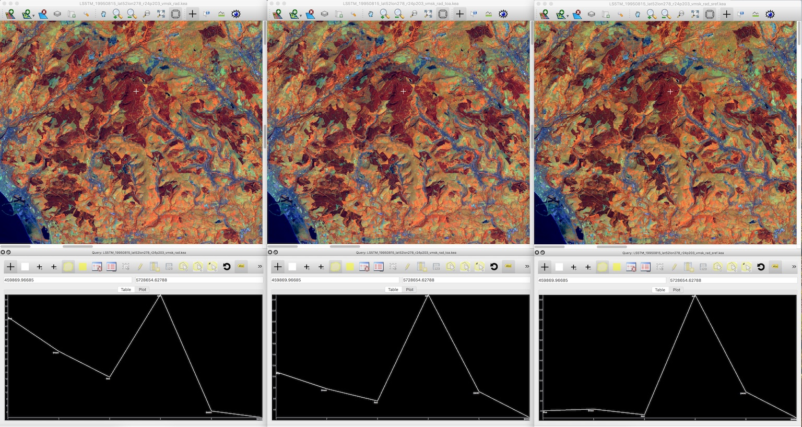
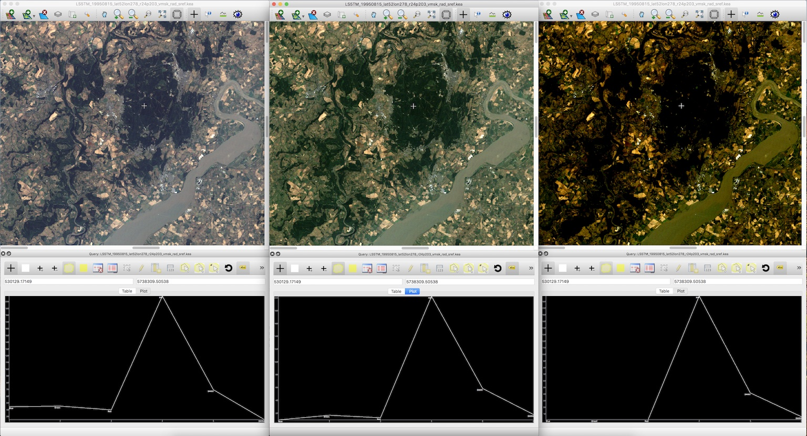
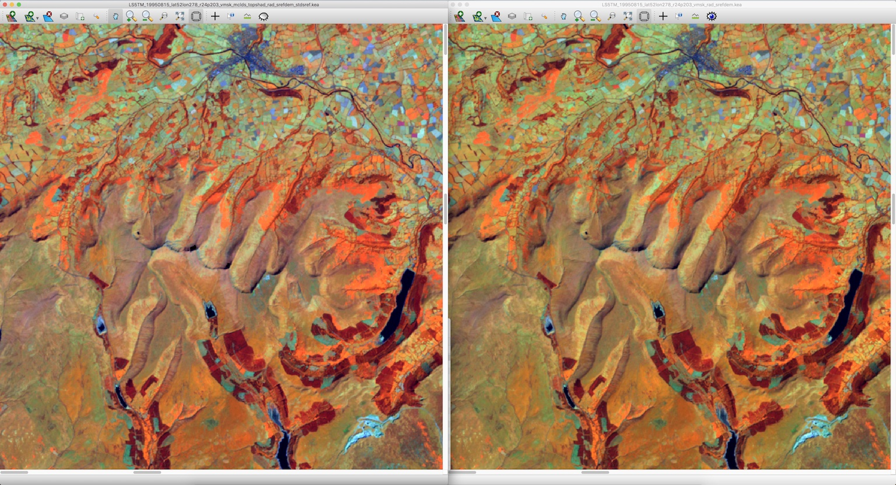

Tutorial
============

Datasets:
-------------------

ARCSI supports a range of sensors but this tutorial will focus on Landsat and Sentinel-2. The majority of examples will be given using Landsat data but these can be changed to Sentinel-2 by just updating the sensor specified.

* `LT05_L1TP_203024_19950815_20180217_01_T1.tar.gz <./tutorial_datasets/LT05_L1TP_203024_19950815_20180217_01_T1.tar.gz>`_
* `LT05_L1TP_204023_19940718_20170113_01_T1.tar.gz  <./tutorial_datasets/LT05_L1TP_204023_19940718_20170113_01_T1.tar.gz>`_
* `LT05_L1TP_204024_19940616_20170114_01_T1.tar.gz  <./tutorial_datasets/LT05_L1TP_204024_19940616_20170114_01_T1.tar.gz>`_
* `LT05_L1TP_204024_19940718_20170113_01_T1.tar.gz  <./tutorial_datasets/LT05_L1TP_204024_19940718_20170113_01_T1.tar.gz>`_
* `S2A_MSIL1C_20170617T113321_N0205_R080_T30UVD_20170617T113319.tar.gz  <./tutorial_datasets/S2A_MSIL1C_20170617T113321_N0205_R080_T30UVD_20170617T113319.tar.gz>`_
* `UKSRTM_90m.kea  <./tutorial_datasets/UKSRTM_90m.kea>`_
* `BritishNationalGrid.wkt  <./tutorial_datasets/BritishNationalGrid.wkt>`_

How to run ARCSI
-------------------

ARCSI is executed using the command line tool ``arcsi.py``. If you run the command without any options then some example commands will be presented. To find help on the options available you can run

.. code-block:: bash

    arcsi.py -h

Getting a dataset
-------------------

However, before running arcsi you will need an image to test against. I have provided the image ``LT05_L1TP_203024_19950815_20180217_01_T1.tar.gz`` covering an areas of South Wales and South West England including the city of Bristol.

Before running ARCSI you need to extract the Landsat scene from the ``tar.gz`` archive file. You could use the command

.. code-block:: bash

    tar -zxf LT05_L1TP_203024_19950815_20180217_01_T1.tar.gz

or

.. code-block:: bash

    arcsiextractdata.py -f ./LT05_L1TP_203024_19950815_20180217_01_T1.tar.gz -o ./

to extract the contents to the current directory but it would be good to have a the contents of the ``tar.gz`` file extracted into a directory for that scene. ARCSI provides a command to do that ``arcsiextractdata.py``. The command operates on all archive files that data is likely to be provided. While is can be applied to a single file it also has the option (shown below) to be applied to an input directory (in this case RAW) where all the archives within the input directory will be extracted to the output directory.

.. code-block:: bash

    arcsiextractdata.py -i ./RAW/ -o Inputs/

Run ARCSI with data
-----------------------

To use ARCSI to generate a surface reflectance product (alongside top of atmosphere and radiance) the simplest method is to specify the parameters via the command line as shown below:

.. code-block:: bash

    arcsi.py -s lstm -f KEA --stats -p RAD TOA SREF --aot 0.25 \
    --surfacealtitude 0.4 -o ./Outputs \
    -i LT05_L1TP_203024_19950815_20180217_01_T1/LT05_L1TP_203024_19950815_20180217_01_T1_MTL.txt

``-s lstm``: specifies that it is a Landsat 5 TM scene which is being processed.

``-f KEA``: specifies that the output image file format should be KEA. Currently, only the KEA format is provided as an option but output files can be converted to another format using the ``gdal_translate`` command.

``--stats``: specifies that the output images should be populate with statistics and pyramids, makes data display much faster

``-p RAD TOA SREF``: specifies the output products to be generated. You only need to specify what you want, e.g., SREF but if other products (e.g., RAD) are required then these will also be produced even if they are not
    specified.

``--aeropro Maritime``: specifies that the 'Maritime' aerosol profile should be used.

``--atmospro MidlatitudeSummer``: specifies that the 'MidlatitudeSummer' atmosphere profile should be
    used.

``--aot 0.25``: specifies that an AOT value of 0.25 will be used for the correction.

``--surfacealtitude 0.4``: specifies that the surface altitude (ground elevation) used for the correction is 400 m or 0.4 km. The value specified needs to be in KM.

``-o ./Outputs``: specifies the output directory where all output file will be outputted to.

``-i LT05_L1TP_203024_19950815_20180217_01_T1/LT05_L1TP_203024_19950815_20180217_01_T1_MTL.txt``: is the input images header file.

Once you have run the command (shown above) open the images within TuiView and compare the surface reflectance, radiance and TOA images, figure below. Please remember that you can open multiple TuiView windows (File > New Window) and tile them (File > Tile Windows\...). Using the band combination NIR, SWIR1 and RED is recommended. Have a look at a number of different land cover and also try to find similar features around clouds and away from clouds (highly productive fields, for example; bright orange in the recommended band combination), what do you notice about the image pixel values? Also, ARCSI multiples the output pixel values by 1000 (this can be edited using the ``--scalefac`` switch) so 100 % reflectance will have a value of 1000 and 1 % will have a value of 10.

You should have noticed that they are different and that is due to the fact that AOT is variable across the scene. Within this worksheet we will just look at using a single value of AOT for correcting the scene but ARCSI already has some functionality to create an AOT surface which will be something for the future, particularly for scenes with high cloud cover.

Changing AOT and Vertical Water Content
-------------------------------------------

You have now atmospherically corrected a scene with a single set of parameters we now need to considered what parameters should you use. You will now undertake a basic sensitivity analysis for AOT and vertical water content to see what effect they have on your atmospherically corrected result.

Changing values of AOT
~~~~~~~~~~~~~~~~~~~~~~~~

AOT values are > 0.0, values are usually < 1.0 but for areas with high level of atmospheric pollution values can get as high as 2.5. To see the effect of changing the AOT value try running ARCSI with the following AOT values:

-   0.05
-   0.1
-   0.15
-   0.2
-   0.25
-   0.3
-   0.4
-   0.5
-   0.75
-   0.95

For example,

.. code-block:: bash

    # AOT 0.05
    arcsi.py -s lstm -f KEA --stats -p RAD TOA SREF --aot 0.05 \
    --surfacealtitude 0.4 -o ./OutputsAOT005 \
    -i LT05_L1TP_203024_19950815_20180217_01_T1/LT05_L1TP_203024_19950815_20180217_01_T1_MTL.txt

    # AOT 0.1
    arcsi.py -s lstm -f KEA --stats -p RAD TOA SREF --aot 0.1 \
    --surfacealtitude 0.4 -o ./OutputsAOT01 \
    -i LT05_L1TP_203024_19950815_20180217_01_T1/LT05_L1TP_203024_19950815_20180217_01_T1_MTL.txt

    # AOT 0.5
    arcsi.py -s lstm -f KEA --stats -p RAD TOA SREF --aot 0.5 \
    --surfacealtitude 0.4 -o ./OutputsAOT05 \
    -i LT05_L1TP_203024_19950815_20180217_01_T1/LT05_L1TP_203024_19950815_20180217_01_T1_MTL.txt

    # AOT 0.95
    arcsi.py -s lstm -f KEA --stats -p RAD TOA SREF --aot 0.95 \
    --surfacealtitude 0.4 -o ./OutputsAOT95 \
    -i LT05_L1TP_203024_19950815_20180217_01_T1/LT05_L1TP_203024_19950815_20180217_01_T1_MTL.txt

Use TuiView to compare the results; open multiple windows with the query tool and open a range of output images, see example in figure below. What changes do you observe? Make notes on these changes with screenshots. Also, what do you notice around areas of cloud cover? You may find it useful to use the band combination RED, GREEN and BLUE for display as the AOT most effects the visible channels. The figure below is displayed using the visible bands (Red, Green, Blue) and you can (hopefully) see that the first (AOT 0.05) looks slight 'hazy', while the middle image looks quite clear with 'strong' colours and the image on the right (AOT 0.95) is over corrected with almost all the visible reflectance removed from the visible bands.

Comparison of spectral curves for SREF images with AOT values of 0.05, 0.5 and 0.95. The image is displayed using the RED, GREEN and BLUE image bands. You can see the image on the left looks a little 'hazy' and the righthand image is over corrected with much of the reflectance removed (i.e., black/dark areas of the image)

Changing values of water content
~~~~~~~~~~~~~~~~~~~~~~~~~~~~~~~~~~

The water content within the vertical column is supplied in units of :math:`g/cm^{2}`. A typical value is 3.6, however the amount of ozone (with units cm-atm) also needs to be specified but in this instance you a constant value of 0.9 throughout. Therefore, it is suggested that you run ARCSI using the following Water Column values:

-   0.5
-   1.0
-   2.0
-   3.0
-   4.0
-   5.0
-   6.0
-   8.0
-   9.0
-   10.0

For example,

.. code-block:: bash

    # Water Content 0.5
    arcsi.py -s lstm -f KEA --stats -p RAD TOA SREF --aot 0.25 \
    --surfacealtitude 0.4 --atmoswater 0.5 --atmosozone 0.9 -o ./OutputsWater05 \
    -i LT05_L1TP_203024_19950815_20180217_01_T1/LT05_L1TP_203024_19950815_20180217_01_T1_MTL.txt

    # Water Content 3
    arcsi.py -s lstm -f KEA --stats -p RAD TOA SREF --aot 0.25 \
    --surfacealtitude 0.4 --atmoswater 3 --atmosozone 0.9 -o ./OutputsWater3 \
    -i LT05_L1TP_203024_19950815_20180217_01_T1/LT05_L1TP_203024_19950815_20180217_01_T1_MTL.txt

    # Water Content 9
    arcsi.py -s lstm -f KEA --stats -p RAD TOA SREF --aot 0.25 \
    --surfacealtitude 0.4 --atmoswater 9 --atmosozone 0.9 -o ./OutputsWater9 \
    -i LT05_L1TP_203024_19950815_20180217_01_T1/LT05_L1TP_203024_19950815_20180217_01_T1_MTL.txt

Again, compare the outputted images to see the effect of editing these values has on the shape of the spectral curves and the spectral values. Which wavelengths have been most effected by this parameter?

Inversion for AOT
-----------------

With time and expert knowledge it would be possible to derive an AOT value for each scene manually or in some regions of the world (e.g., Australia use an AOT of 0.05 Gillingham et al., 2012) it has been found
that a constant can be used. However, for most regions a constant is not viable as the atmosphere is too variable (Wilson et al., 2014) and manually selecting values can be difficult and is time consuming. Therefore, deriving AOT from the image itself is desirable.

ARCSI provides a method of doing this using a dark object subtraction (DOS) to estimate the surface reflectance in blue channel. 6S is then numerically inverted to identify an AOT value which derives a surface reflectance value as close a possible to the estimated. To execute this functionality the following command is used:

.. code-block:: bash

    arcsi.py -s lstm -f KEA --stats -p RAD DOSAOTSGL SREF METADATA \
    -o ./OutputsAOTInv  --dem ./UKSRTM_90m.kea --tmpath ./tmp \
    -i LT05_L1TP_203024_19950815_20180217_01_T1/LT05_L1TP_203024_19950815_20180217_01_T1_MTL.txt

Where:

``--tmpath ./tmp``: is a directory where temporary files can be outputted during the
    processing, these will be deleted afterwards.

``--dem ./UKSRTM_90m.kea``: is an elevation model for the UK, in this case the 90 m SRTM product. The higher the resolution of the DEM available the better and this will be used in place of the ``--surfacealtitude`` command line option. A look up table (LUT) for surface altitude will be created and used for producing the final correction as well. Note. the DEM will be resampled and reprojected to match the input image. Please ensure the projection of the DEM is well defined and the DEM no data value is defined, if it is not defined within the header file (recommended) then the ``--demnodata`` switch can be used.

In the information printed to the console you will be able to see what AOT value is identified (i.e., 0.35), however in this case I've asked for the ``METADATA`` product to be produced which will produced a metadata file associated with image file containing information from the input header file and produced from the processing stages. Alongside, identifying the AOT value this analysis will use the DEM to build a look up table (LUT) for elevation at steps of 100 m. This will help minimise atmospheric variability due to topography.

Operational Commands (i.e., the ones to use); Landsat Example
---------------------------------------------------------------

Operational Command: Base
~~~~~~~~~~~~~~~~~~~~~~~~~~~~

ARCSI has a number of other products and options which can be applied. However, for Landsat imagery the following command which be what is normally applied - please note this command will commonly take up to or over an hour of processing time for a single scene, depending on the hardware being used.

.. code-block:: bash

    arcsi.py -s lstm -p CLOUDS DOSAOTSGL STDSREF METADATA -o ./OutputsStdSREF/ \
    --stats --format KEA --tmpath ./tmp \
    --dem ./UKSRTM_90m.kea --cloudmethods LSMSK \
    --keepfileends  stdsref.kea clouds.kea meta.json \
    -i LT05_L1TP_203024_19950815_20180217_01_T1/LT05_L1TP_203024_19950815_20180217_01_T1_MTL.txt

Where:

``-p CLOUDS DOSAOTSGL STDSREF METADATA``: Specifies the products which are to be produced, in this case
    standardised reflectance, estimation of AOT via a dark object subtractions, undertake a cloud mask and produce metadata file.

``-o ./OutputsStdSREF/``:  directory where outputs will be outputted.

``--stats``: statistics and pyramids (overviews) should be created for visualisation.

``--format KEA``: output file formation (i.e., KEA)

``--tmpath ./tmp``: directory where temporary outputs will be written and then deleted if processing is successful completed. Within the tmp directory a directory with the same name as the output image is created so multiple files can use the same tmp directory.

``--dem ./UKSRTM_90m.kea``: the elevation model to be used for the processing.

``--cloudmethods LSMSK``: there are options of which approach to use for cloud masking. Landsat comes with a good cloud mask using the same approach that ARCSI has implemented (i.e., FMASK) so to just use the cloud mask provided use the option ``LSMSK``.

``--keepfileends stdsref.kea clouds.kea meta.json``: The processing can create a lot of output files, which you may or may not want to keep. This option allows you to specify the file endings of the files you want to keep (i.e., all others are deleted).

Once you have produced this product compare it to the images you previously produced. If you open both images within Tuiview together and flick between between you should see the effect of the standardisation (i.e., topographic correction; Figure below demonstrates).

Please note that for these examples, a lower resolution DEM (i.e., 90 m SRTM) is being used to avoid larger than necessary files to be downloaded etc. You should use the highest resolution and best quality DEM/DSM that you have available.

Operational Command: More Outputs
~~~~~~~~~~~~~~~~~~~~~~~~~~~~~~~~~~~~~~~

Depending on your use case you may want to keep more outputs, in this case the topographic shadow, saturated pixel and valid extent masks.

.. code-block:: bash

    arcsi.py -s lstm -p CLOUDS DOSAOTSGL STDSREF SATURATE TOPOSHADOW FOOTPRINT \
    -o ./OutputsStdSREF2/ --stats --format KEA --tmpath ./tmp \
    --dem ./UKSRTM_90m.kea --cloudmethods LSMSK \
    --k  clouds.kea meta.json sat.kea toposhad.kea valid.kea stdsref.kea \
    -i LT05_L1TP_203024_19950815_20180217_01_T1/LT05_L1TP_203024_19950815_20180217_01_T1_MTL.txt

Operational Command: Not Applying the Generated Image Masks
~~~~~~~~~~~~~~~~~~~~~~~~~~~~~~~~~~~~~~~~~~~~~~~~~~~~~~~~~~~~~~

By default the masks generated by ARCSI are applied to the image being processed, removing areas of imagery from the dataset. However, in some cases, it is useful to output the image data without the masks applied, supplying the masks to the end user who can then decide what they wish to apply to the images. In ARCSI this is done using the ``--fullimgouts`` switch, when this switch is included two versions of the output image are created one with the masks applied and the other without.

.. code-block:: bash

    arcsi.py -s lstm -p CLOUDS DOSAOTSGL STDSREF SATURATE TOPOSHADOW FOOTPRINT \
    -o ./OutputsStdSREFFull/ --stats --format KEA --tmpath ./tmp \
    --dem ./UKSRTM_90m.kea --cloudmethods LSMSK \
    --fullimgouts --k  clouds.kea meta.json sat.kea toposhad.kea valid.kea stdsref.kea \
    -i LT05_L1TP_203024_19950815_20180217_01_T1/LT05_L1TP_203024_19950815_20180217_01_T1_MTL.txt

Operational Command: Re-projection
~~~~~~~~~~~~~~~~~~~~~~~~~~~~~~~~~~~

Another operation which can be included with your ARCSI command is re-projection where the output datasets are re-projected into another coordinated system and projection. There are two switches are needed for this, ``--projabbv`` specifies the string which is added to the output file name to specify the output projection (e.g., osgb for the UK Ordnance Survey Great Britain National Grid) and ``--outproj4`` or
``--outwkt`` to specify the output project using either a WKT or Proj4 string in a text file.

The WKT string for the UK Ordnance Survey National Grid is:

::

    PROJCS["OSGB 1936 / British National Grid",
    GEOGCS["OSGB 1936",
        DATUM["OSGB_1936",
            SPHEROID["Airy 1830",6377563.396,299.3249646,
                AUTHORITY["EPSG","7001"]],
            TOWGS84[446.448,-125.157,542.06,0.15,0.247,0.842,-20.489],
            AUTHORITY["EPSG","6277"]],
        PRIMEM["Greenwich",0,
            AUTHORITY["EPSG","8901"]],
        UNIT["degree",0.0174532925199433,
            AUTHORITY["EPSG","9122"]],
        AUTHORITY["EPSG","4277"]],
    PROJECTION["Transverse_Mercator"],
    PARAMETER["latitude_of_origin",49],
    PARAMETER["central_meridian",-2],
    PARAMETER["scale_factor",0.9996012717],
    PARAMETER["false_easting",400000],
    PARAMETER["false_northing",-100000],
    UNIT["metre",1,
        AUTHORITY["EPSG","9001"]],
    AXIS["Easting",EAST],
    AXIS["Northing",NORTH],
    AUTHORITY["EPSG","27700"]]

You can find these representations of projections from websites such as `https://epsg.io <https://epsg.io>`_ and `https://spatialreference.org <https://spatialreference.org>`_.

The following command will undertake the same analysis as above but the output will be reprojected as OSGB.

.. code-block:: bash

    arcsi.py -s lstm -p CLOUDS DOSAOTSGL STDSREF SATURATE TOPOSHADOW FOOTPRINT \
    -o ./OutputsStdSREFOSGB/ --stats --format KEA --tmpath ./tmp --dem ./UKSRTM_90m.kea \
    --cloudmethods LSMSK --projabbv osgb --outwkt BritishNationalGrid.wkt \
    --k  clouds.kea meta.json sat.kea toposhad.kea valid.kea stdsref.kea \
    -i LT05_L1TP_203024_19950815_20180217_01_T1/LT05_L1TP_203024_19950815_20180217_01_T1_MTL.txt

When you re-project, ARCSI will create a pixel grid which is on a whole pixel grid, i.e., the origin coordinate (top-left corner) will be a whole number rather than have a decimal point or something weird and cumbersome.

Operational Command: Clear-Sky Product
~~~~~~~~~~~~~~~~~~~~~~~~~~~~~~~~~~~~~~~

The next option which can be applied is termed 'clear-sky'. This product aims to identify regions which have large continuous areas of clear-sky data (i.e., no clouds). Specifically, where there are regions of scattered cloud the gaps between the cloud are no always useful for many products and therefore we want to remove them.

The 'clear-sky' product can produced by simply adding ``CLEARSKY`` to the list of products.

.. code-block:: bash

    arcsi.py -s lstm -p CLOUDS DOSAOTSGL STDSREF SATURATE TOPOSHADOW FOOTPRINT CLEARSKY \
    -o ./OutputsStdSREFClearSky/ --stats --format KEA --tmpath ./tmp \
    --dem ./UKSRTM_90m.kea --cloudmethods LSMSK \
    -i LT05_L1TP_203024_19950815_20180217_01_T1/LT05_L1TP_203024_19950815_20180217_01_T1_MTL.txt

Thermal Bands
~~~~~~~~~~~~~~~~

Some sensors (e.g., Landsat) have thermal channels and ARCSI can process these alongside the other bands but only provides a 'at sensor' / 'top of atmosphere' product. For Landsat this product is produced if you select the ``CLOUDS` or ``CLEARSKY`` products are the thermal data is needed as part of the cloud masking. However, if you would like to product this separately without cloud masking then add ``THERMAL`` to the list of products.

.. code-block:: bash

    arcsi.py -s lstm -p DOSAOTSGL SREF THERMAL \
    -o ./OutputsThermal/ --stats --format KEA --tmpath ./tmp --dem ./UKSRTM_90m.kea \
    -i LT05_L1TP_203024_19950815_20180217_01_T1/LT05_L1TP_203024_19950815_20180217_01_T1_MTL.txt

Sentinel-2
-------------

Sentinel-2 has basically the same options as Landsat 4-9, the main difference is that Landsat has a thermal channel(s) while Sentinel-2 provides images bands at different resolutions. The ``THERMAL`` product is therefore not available for Sentinel-2.

ARCSI, currently, outputs a single image for each product and therefore the image bands for Sentinel-2 need to be resampled to match one another. By default ARCSI resamples the 20 m bands to 10 m while the ``--resample2lowres`` switch can be used to produce a 20 m resolution output (i.e., the 10 m bands will be resampled).

Another option which ARCSI provides when resampling the 20 m bands to 10 m you can apply a 'sharpening'. The sharpening product aims to enhance the 20 m image bands using the 10 m bands to produce a sharper stacked 10 m product and works through the application of local linear regression models. The method was first proposed by Dymond and Shepherd (2004) for pan-sharpening Landsat-7 imagery and has subsequently been extended for Sentinel-2. Within ARCSI it is applied to the radiance image where the 20 m bands have been oversampled to 10 m resolution image using a nearest neighbour interpolation. A 7 x 7 pixel filter is applied to the 10 m image stack where within the 7 x 7 window a linear regression is performed independently for each lower resolution band to each higher resolution band. The linear model for each lower resolution image band with the best fit, above 0.5, is then used to predict the image pixel value for the band. If not fit above 0.5 is identified then the image pixel value is not altered.

Basic Sentinel-2 Commands
~~~~~~~~~~~~~~~~~~~~~~~~~~~~

I have provided a sample Sentinel-2 scene over North Wales, just cutting off North of Aberystwyth (``S2A_MSIL1C_20170617T113321_N0205_R080_T30UVD_20170617T113319.SAFE``). The following command provides are basic surface reflectance product with the bands resampled to 10 m, without sharpening:

.. code-block:: bash

    arcsi.py -s sen2 -f KEA --stats -p DOSAOTSGL SREF METADATA \
    -o ./OutputsSen2_10m  --dem ./UKSRTM_90m.kea --tmpath ./tmp \
    -i S2A_MSIL1C_20170617T113321_N0205_R080_T30UVD_20170617T113319.SAFE/MTD_MSIL1C.xml

The following command produces a 20 m resolution output:

.. code-block:: bash

    arcsi.py -s sen2 -f KEA --stats -p DOSAOTSGL SREF METADATA \
    -o ./OutputsSen2_20m  --dem ./UKSRTM_90m.kea --tmpath ./tmp --resample2lowres \
    -i S2A_MSIL1C_20170617T113321_N0205_R080_T30UVD_20170617T113319.SAFE/MTD_MSIL1C.xml

Finally, the following command produces a 10 m resolution product where the 20 m bands have also been sharpened, as described above. Compare this product to the first Sentinel-2 product you produced using Tuiview flicking between the layers. The difference can be difficult to see in places (which is the idea!) but where you have strong boundaries (e.g., field boundaries) and you display the scene using a band combination which includes the SWIR or Red-Edge bands (e.g., NIR, SWIR1, RED) then the improvement through sharpening should be very evident.

.. code-block:: bash

    arcsi.py -s sen2 -f KEA --stats -p DOSAOTSGL SREF METADATA SHARP \
    -o ./OutputsSen2_10mSharp  --dem ./UKSRTM_90m.kea --tmpath ./tmp \
    -i S2A_MSIL1C_20170617T113321_N0205_R080_T30UVD_20170617T113319.SAFE/MTD_MSIL1C.xml

Operational Sentinel-2 Commands
~~~~~~~~~~~~~~~~~~~~~~~~~~~~~~~~~~~

When running through Sentinel-2 to create an Analysis Ready Data (ARD) product the following command or similar (see Landsat examples above) is used.

.. code-block:: bash

    arcsi.py -s sen2 -p CLOUDS DOSAOTSGL STDSREF SHARP METADATA -o ./OutputsSen2ARD/ \
    --stats --format KEA --tmpath ./tmp --dem ./UKSRTM_90m.kea \
    --cloudmethods S2LESSFMSK --keepfileends  stdsref.kea clouds.kea meta.json \
    -i S2A_MSIL1C_20170617T113321_N0205_R080_T30UVD_20170617T113319.SAFE/MTD_MSIL1C.xml

Note. there are three cloud masking options. The recommended (i.e., we think produces the best results) is ``S2LESSFMSK``, which runs the S2CLOUDLESS and FMASK algorithms and takes the union of the two. If you want to just run FMask or S2Cloudless then there are also options for those as well: ``S2CLOUDLESS`` and ``FMASK``.

Batch Processing
----------------

One of the most exciting things about these data (i.e., Landsat and Sentinel-2) is that they are global and freely available. However, downloading and processing large amounts of this data is challenging. However, ARCSI has some commands and tools which can make handling these data easier and feasible. If you have a high performance computer (HPC) available then you can process some very large datasets using these
tools.

When a large number of scenes require processing then commands that automate steps are desirable and greatly simplifies the process. ARCSI provides a number of commands which are useful for batch processing:

``arcsiextractdata.py``: extracts the contents of archives, with each archive being extracted into an individual directory.

``arcsibuildcmdslist.py``: builds the ``arcsi.py`` commands for each scene creating a shell script.

The files provided for this example are shown below, but others could be downloaded and added to the directory (all files need to be within the same directory), a mixture of landsat scenes is OK but not a mixture of different sensors (e.g., Sentinel-2 and Landsat) process the different sensors seperately.

.. code-block:: bash

    LT05_L1TP_204023_19940718_20170113_01_T1.tar.gz
    LT05_L1TP_204024_19940616_20170114_01_T1.tar.gz
    LT05_L1TP_204024_19940718_20170113_01_T1.tar.gz

Extracting Data
~~~~~~~~~~~~~~~~~

I find it useful to create the following directory structure for my processing:

.. code-block:: bash

    Inputs
    Outputs
    RAW
    tmp

To extract all scenes the ``arcsiextractdata.py`` is used as shown below:

.. code-block:: bash

    arcsiextractdata.py -i RAW/ -o Inputs/

Once the files are extracted the directory structure will look like the following:

.. code-block:: bash

    > ls RAW/
    LT05_L1TP_204023_19940718_20170113_01_T1.tar.gz
    LT05_L1TP_204024_19940616_20170114_01_T1.tar.gz
    LT05_L1TP_204024_19940718_20170113_01_T1.tar.gz

    > ls */Inputs
    Inputs/
    LT05_L1TP_204023_19940718_20170113_01_T1
    LT05_L1TP_204024_19940616_20170114_01_T1
    LT05_L1TP_204024_19940718_20170113_01_T1

Building ARCSI Commands
~~~~~~~~~~~~~~~~~~~~~~~~~

Now the data have been extracted the relevant ``arcsi.py`` commands, one for each input file, need to be created. If you had a large number of input files this would be very time consuming and error prone to do
manually, therefore we will use a script to automate it.

Notice that these are very similar to the individual commands that you previously executed but now provide inputs to the ``arcsibuildcmdslist.py`` command which selects a number of input files and generate a single shell script output.

.. code-block:: bash

    arcsibuildcmdslist.py -s lstm -f KEA --stats -p CLOUDS DOSAOTSGL STDSREF \
    --outpath ./Outputs --dem ../UKSRTM_90m.kea --cloudmethods LSMSK \
    --keepfileends stdsref.kea clouds.kea \
    --tmpath ./tmp -i ./Inputs -e "*MTL.txt" -o LSARCSICmds.sh

Following the execution of this command the following file will have been created ``LSARCSICmds.sh``. This file contain the ``arcsi.py`` commands to be executed. Open the file and take a look, you will notice that all the file paths have been convert to absolute paths which means the file can be executed from anywhere on the system as long as the input files are not moved.

If you have a selection of landsat scenes from different versions of the sensor or wish to have a generic command you can use for all then if you define the sensor as ``LANDSAT`` then the function will automatically derive the landsat sensor version. For example:

.. code-block:: bash

    arcsibuildcmdslist.py -s LANDSAT -f KEA --stats -p CLOUDS DOSAOTSGL STDSREF \
    --outpath ./Outputs --dem ../UKSRTM_90m.kea --cloudmethods LSMSK \
    --keepfileends stdsref.kea clouds.kea \
    --tmpath ./tmp -i ./Inputs -e "*MTL.txt" -o LSARCSICmds.sh

Executing ARCSI Commands
~~~~~~~~~~~~~~~~~~~~~~~~~~

To execute the `arcsi.py` commands the easiest methods is to run each in turn using the following command:

.. code-block:: bash

    sh LSARCSICmds.sh

This will run each of the commands sequentially. However, most computers now have multiple processing cores and to take advantage of those cores we can use the GNU ``parallel`` command line tool (<http://www.gnu.org/software/parallel/>). Taking advantage of those cores means that processing can be completed much quicker and more efficiently.

.. code-block:: bash

    parallel -j 4 < LSARCSICmds.sh

The switch ``-j 4`` specifies the number of processing cores which can be used for this processing. If no switches are provided then all the cores will be used, ensure that you don't request more resources than you have available. Please note, until all processing for a scene has completed, nothing will be printed to the console.

Once you have completed your processing you should clean up your system to remove any files you don't need for any later processing steps. In most cases you will only need to keep the original archives (so you can reprocess the RAW data at a later date if required) and the SREF product with relevant masks and metadata. It is recommended that you also retain the scripts you used for processing and a record of the commands you used for a) reference if you need to rerun the data and b) as documentation for the datasets so you know what parameters and options were used.

Sentinel-2
----------

Processing Sentinel-2 and other sensors is identical to the steps shown above. However, one caution of processing Sentinel-2 is that it difficult to uniquely identify the image header file. The correct header file is always within the top level of the SAFE file structure. To ensure that the correct file is found you need to use the ``-d / --depth`` switch which controls the depth in the file structure to which the search is carried out.

As an example, the following command was used to process several thousand Sentinel-2 granules for the UK.

.. code-block:: bash

    arcsibuildcmdslist.py -i ./Inputs -o ./Sen2ARCSICmds.sh \
    -e "*MTD*.xml" -d 1 -f KEA --stats --outpath ./Outputs --cloudmethods LSMSK \
    -p RAD SATURATE TOPOSHADOW TOA CLOUDS DOSAOTSGL SREF STDSREF SHARP FOOTPRINT METADATA \
    -s sen2 --checkouts --fullimgouts --outproj4 ./osgb_proj4.prj \
    --projabbv osgb --tmpath ./tmp --dem ./SRTM_1arc_UK.kea

Downloading Landsat and Sentinel-2 Data
---------------------------------------

One of the biggest challenges of undertaking large data processing tasks is always downloading and getting hold of the data. Here, ARCSI can help again -- with a lot of help from Google!

Google provide, what are referred to as, Cloud Buckets with the Sentinel-2 and Landsat image archives through which these data are freely available and accessible.

-   Landsat Bucket: `<https://cloud.google.com/storage/docs/public-datasets/landsat>`_

-   Sentinel-2 Bucket: `<https://cloud.google.com/storage/docs/public-datasets/sentinel-2>`_

Search and Find Data
~~~~~~~~~~~~~~~~~~~~~~~~

Alongside the datasets, Google also make CSV files with the associated meta-data for all the images stored available for download. This is very useful as it allow us to search and find the scenes/granules we might be
interested in.

ARCSI provides commands to automatically download and build a local database of these meta-data.

.. code-block:: bash

    # Setup Landsat Database
    arcsisetuplandsatdb.py -f landsatdb-20200201.db

    # Setup Sentinel-2 Database
    arcsisetupsen2db.py -f sentinel2db-20200201.db

Setting up these databases can take a few minutes. However, once they are set up you can use the commands ``arcsigenlandsatdownlst.py`` and ``arcsigensen2downlst.py`` to generate a list of scenes to download using the Google Cloud Tools (`<https://cloud.google.com/sdk/>`_).

Querying Landsat is perform on a per row/path basis while for Sentinel-2 it is per granule. Therefore, if you require more than one row/path or granule you'll need to run the command multiple times but this can be done with a simple script if the number of rows/paths or granules is large.

Both commands let you specify a date range of interest, if no range is specified then the whole range is considered. An upper cloud threshold (i.e., cloud percentage less then XX%) can also be specified. For landsat you can also specify the sensor, spacecraft and collection and where nothing is specified it is assumed all are of interest.

When considering landsat it is recommended that only collection 'T1' are normally considered as 'T2', 'RT' and 'PRE' can have some limitations in terms of registration etc. More information is available from here: `<https://landsat.usgs.gov/landsat-collections>`_.

To download image for the French Guiana coast to assess mangrove change then the following commands could be used:

.. code-block:: bash

    arcsigenlandsatdownlst.py -f landsatdb-20200201.db -p 227 -r 56 --cloudcover 70 \
    --collection T1 --startdate 1989-01-01 --enddate 1991-12-31 \
    -o ./Dwnlds_r227_p56_1990_T1.sh --outpath './Dwnlds/1990' --lstcmds --multi

    arcsigenlandsatdownlst.py -f landsatdb-20200201.db -p 227 -r 56 --cloudcover 70 \
    --collection T1 --startdate 1994-01-01 --enddate 1996-12-31 \
    -o ./Dwnlds_r227_p56_1995_T1.sh --outpath './Dwnlds/1995' --lstcmds --multi

    arcsigenlandsatdownlst.py -f landsatdb-20200201.db -p 227 -r 56 --cloudcover 70 \
    --collection T1 --startdate 1999-01-01 --enddate 2001-12-31 \
    -o ./Dwnlds_r227_p56_2000_T1.sh --outpath './Dwnlds/2000' --lstcmds --multi

    arcsigenlandsatdownlst.py -f landsatdb-20200201.db -p 227 -r 56 --cloudcover 70 \
    --collection T1 --startdate 2004-01-01 --enddate 2006-12-31 \
    -o ./Dwnlds_r227_p56_2005_T1.sh --outpath './Dwnlds/2005' --lstcmds --multi

    arcsigenlandsatdownlst.py -f landsatdb-20200201.db -p 227 -r 56 --cloudcover 70 \
    --collection T1 --startdate 2009-01-01 --enddate 2011-12-31 \
    -o ./Dwnlds_r227_p56_2010_T1.sh --outpath './Dwnlds/2010' --lstcmds --multi

    arcsigenlandsatdownlst.py -f landsatdb-20200201.db -p 227 -r 56 --cloudcover 70 \
    --collection T1 --startdate 2014-01-01 --enddate 2016-12-31 \
    -o ./Dwnlds_r227_p56_2015_T1.sh --outpath './Dwnlds/2015' --lstcmds --multi

Note. the ``--lstcmds`` switch requests that the full commands are outputted rather than just the urls and ``--multi`` specifies that multiple connections are used for the download.

### Perform Download

To perform the download requires that the Google Cloud tools are downloaded and set up on your machine such that the ``gsutils`` commands is available on your system.

Once you have the tools installed you should then be able to run the script (e.g., ``Dwnlds_r227_p56_2015_T1.sh``) to download the data, created by the ``arcsigenlandsatdownlst.py`` or ``arcsigensen2downlst.py`` commands.

An example command to download a scene will look like:

.. code-block:: bash

    gsutil -m cp -r gs://gcp-public-data-landsat/LE07/01/227/056/LE07_L1TP_227056_19990810_20170217_01_T1 ./Dwnlds/2000

Make sure the output directory exists but once the download has finished you can then use ARCSI as you would have done, the data is not within an archive so you can skip the data extraction step.

Other Useful Bits/Bobs
------------------------

``arcsibuildfilenameslu.py`` is a command which allows you to build a look up table (LUT) referencing the input archive name to the output file name generated by ARCSI.

``arcsifindnotprocessed.py`` is a command which can find scenes which have no been processed yet (i.e., there is not output files).

``arcsiremoveduplicates.py`` is a command for checking for and removing duplicate files - similar to the command above for Sentinel-2.

``arcsibuildmultifilelists.py`` create identify images which are captured within the same path. Functionality which is not yet covered within this tutorial, ARCSI are the option of processing paths ensuring the images within the paths are processed such that they follow each other without hard boundaries. This command generates the scene lists as a text file ready to be put into arcsi.py.

``arcsimpi.py`` when processing paths, multiple processing cores can be used using ``arcsi.py`` this only works for shared memory machines (e.g., normal desktops, virtual machines etc.). For HPC clusters, ``arcsimpi.py`` provides the option of using MPI to access multiple nodes/cores across the HPC. If you want to use this functionality, it is probably best to email the mailing list and we can provide you some support.

Conclusions
------------

Hopefully, this tutorial has reminded you of the basics of atmospheric correction and shown you how to implement that functionality within ARCSI, both basic functionality and more complex batch processing and
generation of analysis ready data (ARD) products. Using the materials from this tutorial worksheet you should now be in a position to process thousands of landsat and Sentinel-2 scenes if you have the  computational resource available.

Don't forget there is the mailing list `<https://groups.google.com/forum/#!forum/rsgislib-support>`_, which is often quite active, if you need any help or support.

* :ref:`genindex`
* :ref:`modindex`
* :ref:`search`

